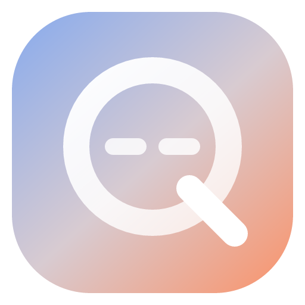
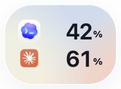
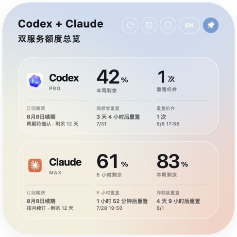
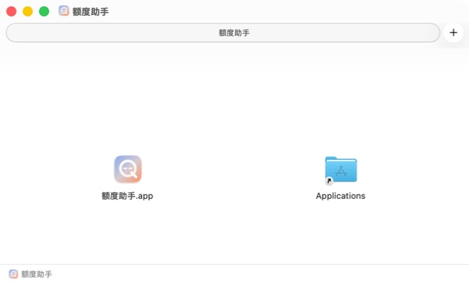
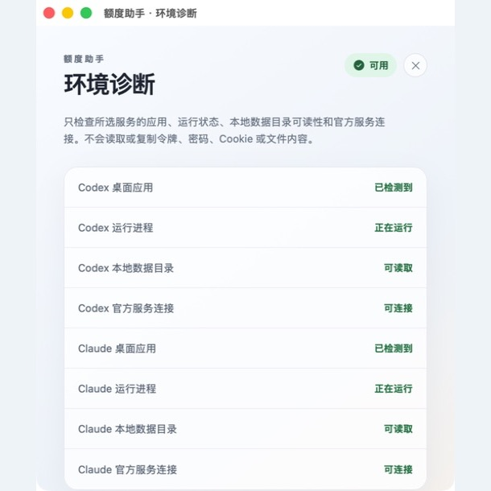

<p align="center">
  
</p>
<h1 align="center">额度助手 v0.2.5</h1>
<p align="center">
  <a href="README.md">简体中文</a> · <a href="README.en.md">English</a>
</p>
<p align="center">
  <a href="https://github.com/H-bai01/quota-assistant/actions/workflows/ci.yml"></a>
  <a href="https://github.com/H-bai01/quota-assistant/releases"></a>
  <a href="LICENSE"></a>
  
  
</p>

<p align="center"><strong>在一个悬浮窗里看清 AI 工具额度、重置时间和订阅周期。</strong></p>
<p align="center">额度助手正向通用 AI 工具监控发展；当前版本支持 Codex 与 Claude。</p>

<p align="center">
  <strong><a href="https://github.com/H-bai01/quota-assistant/releases/download/v0.2.5/quota-assistant_0.2.5_macos_universal.dmg">下载 macOS 版</a></strong>
  &nbsp;·&nbsp;
  <strong><a href="https://github.com/H-bai01/quota-assistant/releases/download/v0.2.5/quota-assistant_0.2.5_windows_x64-setup.exe">下载 Windows Beta</a></strong>
</p>
<p align="center"><a href="https://github.com/H-bai01/quota-assistant/releases">查看全部 Releases</a></p>

> 安装包发布在 GitHub **Release assets** 中；仓库右侧的 **Packages** 是另一种软件包服务，本项目没有使用，因此显示为空是正常的。社区版未签名，首次打开时可能看到 Gatekeeper 或 SmartScreen 来源确认提示。

## 三步开始使用

1. 安装并打开额度助手；Codex Desktop 需已在同一台电脑登录。
2. 展开悬浮窗，点击“连接 Claude”，在应用打开的 Claude 官方页面完成登录。
3. 点击日历按钮获取订阅信息；若需要确认购买来源，只在应用打开的官方页面登录。

## 你可以看到什么

- **剩余额度**：当前支持 Codex 周额度，以及 Claude 5 小时与周额度。
- **重置时间**：直接显示下一次额度恢复时间和可用重置机会。
- **订阅周期**：展示购买来源、续期日期，并在到期前 1 天复核。
- **菜单栏/托盘**：显示、隐藏、刷新、切换语言、解锁和退出。

## 两种显示方式

### 迷你浮窗

适合常驻桌面，快速查看 Codex 与 Claude 的剩余比例；点击即可展开。

<p align="center">
  <br>
  <strong>迷你浮窗</strong>
</p>

### 展开总览

展示每项服务的额度、重置时间或重置机会，以及订阅续期信息。

<p align="center">
  <br>
  <strong>展开总览</strong>
</p>

## 平台状态

| 平台 | 下载 | 当前状态 |
|---|---|---|
| macOS | Universal DMG | 主要支持平台，发布前使用对应安装包完成实机验收 |
| Windows | x64 EXE | Windows Beta；尚未完成 Windows 实机 GUI 验收，不列为已验证支持 |

Windows Beta 会保留自动构建、SHA-256、manifest、SBOM 和 attestation 记录，但这些记录不能代替 Windows 实机使用验收。

## 安装说明

### macOS

1. 下载 DMG，把“额度助手”拖入“应用程序”。
2. 当前 GitHub 社区版未使用 Apple 开发者签名。首次打开若被系统拦截，请确认下载地址来自本仓库，再右键应用选择“打开”，或前往“系统设置 → 隐私与安全性”允许打开。

<p align="center"></p>

### Windows Beta

下载 EXE 后按安装向导操作。当前安装包未使用 Windows 代码签名，SmartScreen 可能显示“未知发布者”；请确认下载地址来自本仓库的 GitHub Releases。

## 数据与隐私

- 额度和订阅摘要保存在本机，不包含密码、验证码或登录 Cookie。
- 没有广告、遥测或第三方跟踪。
- 需要登录时，只使用应用打开的 Codex、Claude、Apple 或 Google 官方页面。
- 环境诊断默认不运行；用户可从展开界面顶部的“环境诊断”按钮主动打开，数据抓取失败时应用也可提示。只有用户主动操作或同意后，才运行最少检查。

完整说明见 [隐私说明](PRIVACY.md) 与 [安全说明](SECURITY.md)。

## 常见问题

### Codex 有数据，Claude 显示未连接

Codex 使用本机已有登录状态；Claude 使用额度助手内的独立会话。点击“连接 Claude”完成一次登录即可。

### 登录后仍提示登录

关闭登录窗口，重新点击“获取订阅信息”。若会话失效，应用会提示再次登录，不会无限等待。

### 数据抓取失败时如何检查

环境诊断默认不运行。你可以从展开界面顶部的“环境诊断”按钮主动打开；数据抓取失败时，应用也会询问是否开启。只有你主动操作或同意后，才运行所选服务所需的最少检查。

<p align="center">
  <br>
  <strong>按需环境诊断</strong>
</p>

### 如何更新或卸载

从 [GitHub Releases](https://github.com/H-bai01/quota-assistant/releases) 下载新版本并覆盖安装。卸载前先退出应用；如需同时清除本地偏好和登录会话，请按照 [隐私说明](PRIVACY.md) 操作。

## 开发与贡献

需要 Node.js 20.19.0+、仓库锁定的 Rust 1.97.1 和 Tauri 平台依赖。

```bash
npm ci
npm test
npm run build
cargo test --manifest-path src-tauri/Cargo.toml --locked
```

参与开发请阅读 [贡献指南](CONTRIBUTING.md)。发布与维护资料位于 [docs](docs/)。

## 来源、许可与支持

本项目基于 MIT 许可的 [Quota Float](https://github.com/change-42-yhmm/quota-float) 开发，并使用 [MIT License](LICENSE) 发布。资产与商标说明见 [docs/ASSET-PROVENANCE.md](docs/ASSET-PROVENANCE.md)。本项目不是 OpenAI、Anthropic 或 Apple 的官方产品。

遇到普通问题或有功能建议，请使用 [GitHub Issues](https://github.com/H-bai01/quota-assistant/issues)。已知限制见 [docs/KNOWN-LIMITATIONS.md](docs/KNOWN-LIMITATIONS.md)。
