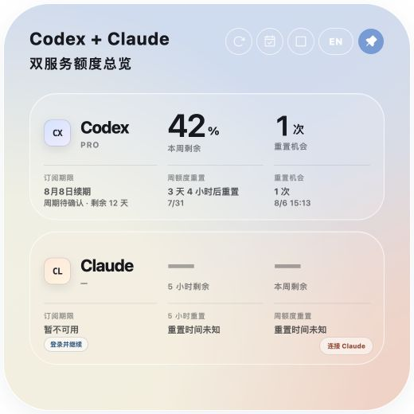
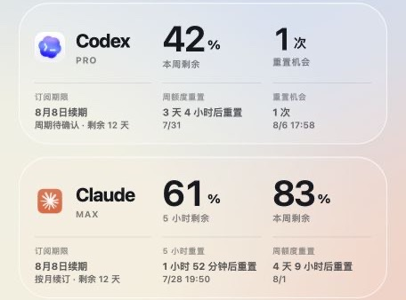

<p align="center">
  
</p>
<h1 align="center">额度助手</h1>
<p align="center">
  <a href="README.md">简体中文</a> · <a href="README.en.md">English</a>
</p>
<p align="center">
  <a href="https://github.com/H-bai01/quota-assistant/actions/workflows/ci.yml"></a>
  <a href="https://github.com/H-bai01/quota-assistant/releases"></a>
  <a href="LICENSE"></a>
  
  
</p>

<p align="center">在一个桌面悬浮窗中查看 Codex 与 Claude 的剩余额度、重置时间和订阅续期日期。</p>

<p align="center">
  
</p>

<p align="center">
  <strong><a href="https://github.com/H-bai01/quota-assistant/releases">前往 GitHub Releases 下载</a></strong><br>
  macOS DMG · Windows Beta EXE · SHA256SUMS.txt
</p>

> 安装包位于 GitHub **Release assets**；仓库右侧 **Packages** 为空是正常的。v0.2.3 Release 附件包括 `quota-assistant_0.2.3_macos_universal.dmg` 和 `quota-assistant_0.2.3_windows_x64-setup.exe`，请在对应 Release 中下载。

## 三步开始使用

1. 下载并安装对应平台的额度助手，保持本机 Codex Desktop 已登录。
2. 展开悬浮窗，点击“连接 Claude”，在应用打开的 Claude 官方页面完成登录。
3. 点击日历按钮获取订阅信息；需要 Apple 确认时，只在 Apple 官方页面登录。

<p align="center">
  
  
</p>

## 主要功能

- **双服务总览**：查看 Codex 周额度、Claude 5 小时/周额度与重置时间。
- **订阅信息**：展示购买来源、周期和已确认的续期日期，到期前 1 天复核。
- **悬浮窗**：支持紧凑/展开、拖动、置顶和鼠标穿透锁定。
- **菜单栏/托盘**：显示、隐藏、刷新、切换语言、解锁和退出。
- **本地诊断**：默认关闭；仅在数据抓取失败且用户主动同意后运行，摘要不含令牌、Cookie、邮箱和完整个人路径。

<p align="center">
  
</p>

## 安装、安全与隐私

GitHub 社区版尚未使用 macOS Developer ID/Apple 公证或 Windows Authenticode 签名，系统可能显示 Gatekeeper、SmartScreen 或“未知发布者”提示。只从本仓库 Releases 下载，先用同一 Release 中的 `SHA256SUMS.txt` 核对文件，再继续安装。

额度助手无遥测、广告或第三方跟踪。Codex 令牌仅在 Rust 后端内存中访问固定官方接口；Claude Cookie 由应用自己的系统 WebView 保管；Apple 页面只交付服务名、套餐、状态和续期日期等最少字段。详见 [PRIVACY.md](PRIVACY.md) 与 [SECURITY.md](SECURITY.md)。

### macOS

1. 下载 DMG 和 `SHA256SUMS.txt`，核对后将“额度助手”拖入“应用程序”。
2. 若 Gatekeeper 拦截，在确认来源和 SHA-256 后右键应用选择“打开”，或查看“系统设置 → 隐私与安全性”。

<p align="center"></p>

### Windows Beta

1. 下载 EXE 和 `SHA256SUMS.txt`，核对后运行安装包。
2. 每次 Windows Beta 发布都必须包含自动构建、SHA-256、manifest、SBOM 和 attestation 资料；尚未完成 Windows 实机 GUI 验收，不列为已验证支持。

## 常见问题

### Codex 有数据，Claude 仍显示未连接

Codex 读取本机 Codex 登录状态；Claude 使用额度助手内的隔离会话。请点击“连接 Claude”。

### 登录完成后仍提示登录

关闭登录窗口后重试“获取订阅信息”。认证失败或窗口关闭后，程序会停止等待并允许重试。

### 如何更新或卸载

当前没有自动更新通道，请从 [GitHub Releases](https://github.com/H-bai01/quota-assistant/releases) 下载新版本。卸载前先退出并关闭开机启动；普通卸载不会自动删除偏好和 WebView 会话，彻底清除前请阅读 [PRIVACY.md](PRIVACY.md)。

## 开发与贡献

需要 Node.js 20.19.0+、仓库锁定的 Rust 1.97.1 和 Tauri 平台依赖。

```bash
npm ci
npm test
npm run build
cargo test --manifest-path src-tauri/Cargo.toml --locked
```

参与开发前请阅读 [CONTRIBUTING.md](CONTRIBUTING.md)、[发布流程](docs/RELEASE.md)、[测试矩阵](docs/TEST-MATRIX.md) 和 [公开文件边界](docs/PUBLIC-REPOSITORY-BOUNDARY.md)。

## 来源、许可与支持

本项目基于 MIT 许可的 [Quota Float](https://github.com/change-42-yhmm/quota-float) 开发，源码使用 [MIT License](LICENSE)。资产来源与商标说明见 [docs/ASSET-PROVENANCE.md](docs/ASSET-PROVENANCE.md)。本项目不是 OpenAI 或 Anthropic 的官方产品，也未获得其背书。

已知限制见 [docs/KNOWN-LIMITATIONS.md](docs/KNOWN-LIMITATIONS.md)，版本记录见 [docs/releases/](docs/releases/README.md)，普通问题请使用 [GitHub Issues](https://github.com/H-bai01/quota-assistant/issues)。
